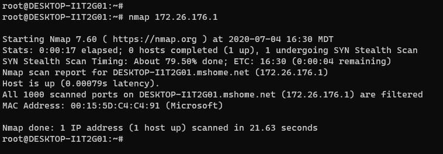
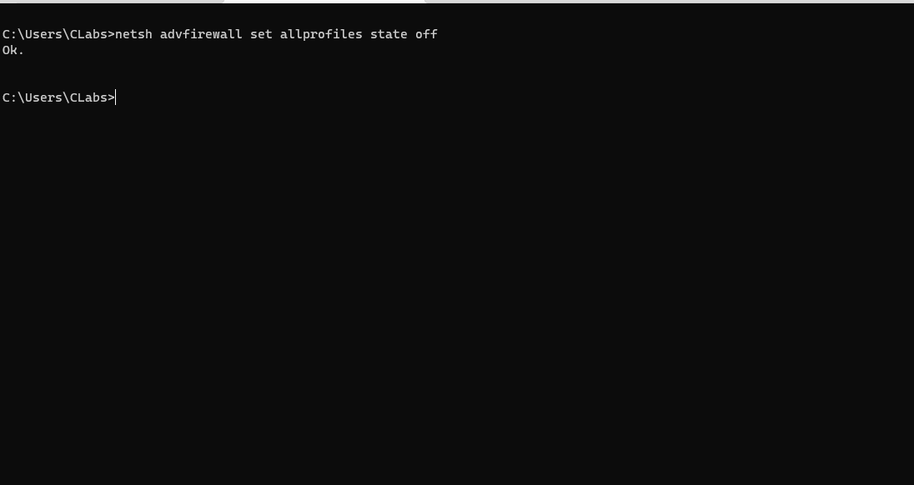

# Nmap

In this lab we will be scanning your Windows system from your Linux terminal with the firewall both on and off. 

The goal is to show you how a system is very different to the network with a firewall enabled. 

Remember, treat your internal network as hostile, because it is.

Let's get started by opening a Terminal as Administrator:

Now, let's open a command Prompt:

From the command prompt we need to get the IP address of your Windows system:

C:\Users\adhd>`ipconfig`

Please note your IP for your WSL address.  Mine is 172.26.176.1.  Yours will be different.

Now, let’s try and scan your Windows system from Ubuntu.  To do this open a Ubuntu command prompt:

Next, let’s become root:

adhd@DESKTOP-I1T2G01:/mnt/c/Users/adhd$ `sudo su -`

Then, we will scan your Windows system:

root@DESKTOP-I1T2G01:~# `nmap 172.26.176.1`

You can hit the spacebar to get status.

It should look like this:

Now, let’s go back to the Windows command prompt, by selecting the Administrator: Command Prompt tab.

Now, let’s disable the Windows firewall:

C:\Users\adhd>`netsh advfirewall set allprofiles state off`

It should look like this:

Now, let’s rescan from Linux.  Please select the Ubuntu tab:

Then, rerun the scan

root@DESKTOP-I1T2G01:~# `nmap 172.26.176.1`

Please note, you can just hit the up arrow key.

Once again, you can hit the spacebar to see status.

It should look like this:

Please note the open ports. These are ports and services that an attacker could use to authenticate to your system.  Or, attack if an exploit is available. 

