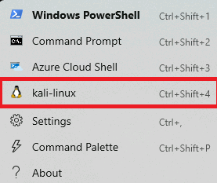

# Responder

In this lab we are going to walk through how quickly an attacker can take advantage of a common misconfiguration to gain access to a system via a weak password.

Specifically, we are looking to take advantage of LLMNR.  

First, we will need to load our terminal and start responder.

Let's get started by opening a Terminal as Administrator

When you get the User Account Control Prompt, select Yes.

And, open a Ubuntu command prompt:

Next, let’s become root:

adhd@DESKTOP-I1T2G01:/mnt/c/Users/adhd$ `sudo su -`

Let’s change into the Responder directory:

root@DESKTOP-I1T2G01:~# `cd /opt/Responder/`

And let’s start Responder:

root@DESKTOP-I1T2G01:/opt/Responder# `responder -v -I eth0`

Now, let's go back to your Windows system and open Windows Explorer and put in the string \\NonExistent into the address bar.

Give it a few moments and you should see some capture data showing up.  Please note there may be an error.  That is OK.

Next we need to kill Responder with Ctrl + c.  This will return the command prompt. 

Now, we need to change to the logs directory.

root@DESKTOP-I1T2G01:/opt/Responder# `cd /usr/share/responder/logs`

Once there, we will need to start John The Ripper"

root@DESKTOP-I1T2G01:/usr/share/responder/logs# `john --format=netntlmv2 SMB-NTLMv2-SSP-fe80\:\:2524\:e51e\:966\:e42f.txt`
Remember!  Your IPv6 will be different!!!!

We can see that the password was cracked (clabs).

# Mitigation methods

## Disable LLMNR with Active Directory GPO:

Active Directory has a GPO you can configure to prevent its domain workstations from using LLMNR.

Use Local Group Policy editor by running gpedit.msc and modifying the policy.

Create a New or Update an existing Group Policy and Edit accordingly:

`Computer Configuration` -> `Administrative Templates` -> `Network` -> `DNS Client` Enable `Turn Off Multicast Name Resolution policy` by changing its value to `Enabled`

See screenshots below

## Disable LLMNR with Command Line (Single Workstation, Windows 7,8,10 Home)

REG ADD  "HKLM\Software\policies\Microsoft\Windows NT\DNSClient"
REG ADD  "HKLM\Software\policies\Microsoft\Windows NT\DNSClient" /v  "EnableMulticast" /t REG_DWORD /d "0" /f
