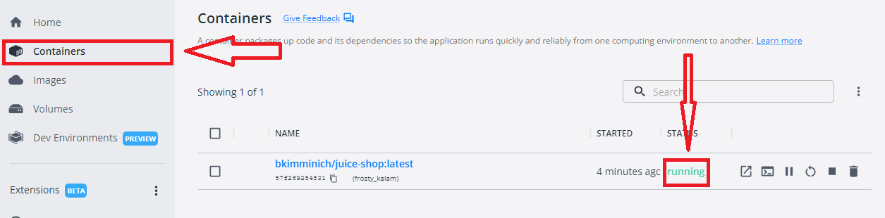

# Web Testing

In this lab we will be standing up a vulnerable web server called OWASP Juicy Shop.  It is designed from the ground up to teach people about a number of web application attacks.

While a full intro to web attacks is out of the scope of this class, it is great to show you how to use tools like BurpSuite & Nikto  to automatically look for some vulnerabilities, and to show you that automated tools do not always catch everything.

Let’s get started by opening a Docker Desktop as Administrator

In menu tab select `Images`

You will see the image called `bkimminich/juice-shop`, click the button `RUN` and set the port on local host section to 80.

