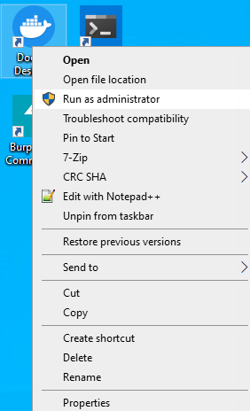
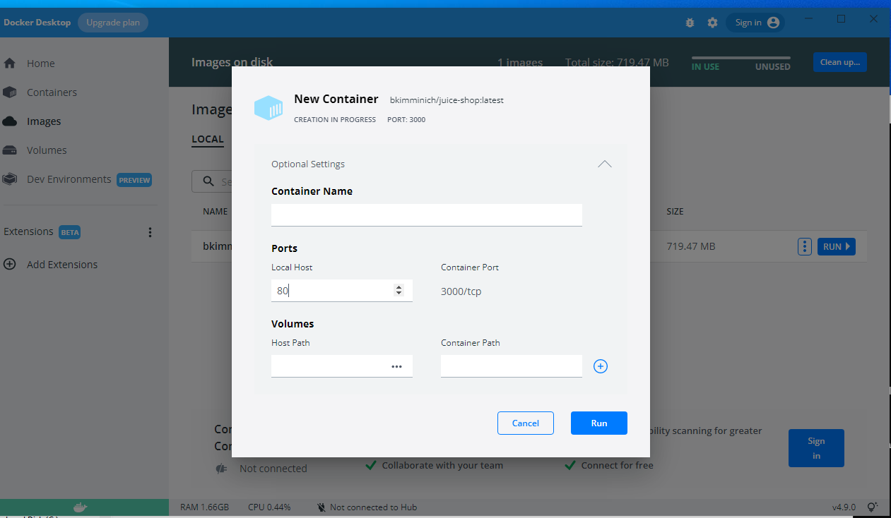
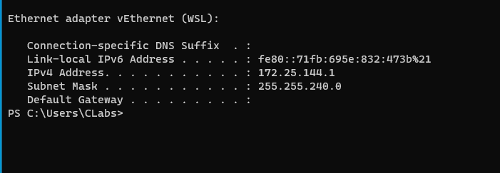
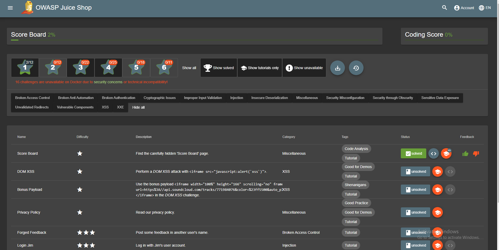
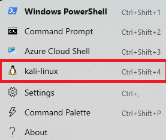
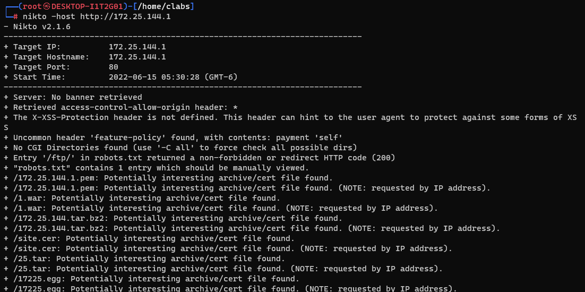

# Web Testing

In this lab we will be starting up a vulnerable web server called OWASP Juicy Shop.  It is designed from the ground up to teach people about a number of web application attacks.

While a full intro to web attacks is out of the scope of this class, it is great to show you how to use tools like BurpSuite & Nikto  to automatically look for some vulnerabilities, and to show you that automated tools do not always catch everything.

Let’s get started by opening a Docker Desktop as Administrator

In menu tab select `Images`

You will see the image called `bkimminich/juice-shop`, click the button `RUN` and set the port on local host section to 80 and click `RUN`.

Get the ip address, note that your ip will be different

Lets check that Juicy Shop is running by going to the address http://172.25.144.1/#/score-board. You will see a list of vulnerabilities sorted by difficulty.

  
Lets switch over to Kali to do some automatic scans with Nikto and see how many vulnerabilties it can detect.

Run the next command `nikto -host http://172.25.144.1` (Your ip will be different). We can see that it detected the url path named `/ftp` that contains valuable information, other than that false positives are rampant.

Next, let's try to poke around the application with BurpSuite by itercepting requests and check manually for some vulnerabilties.
