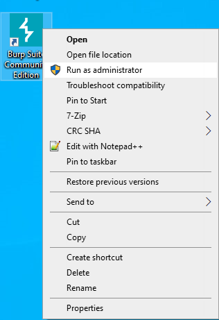
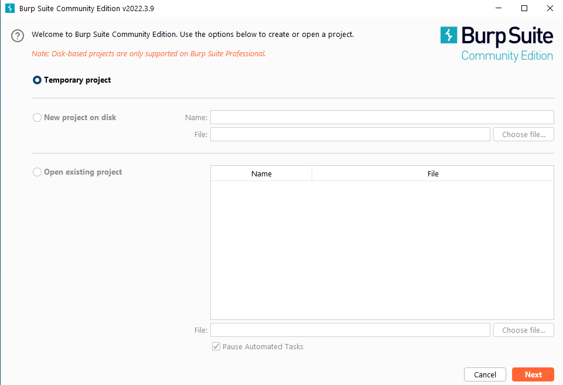
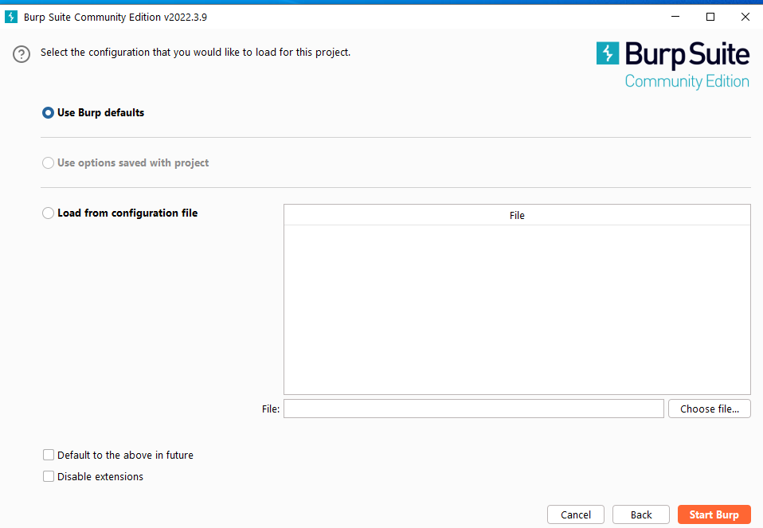
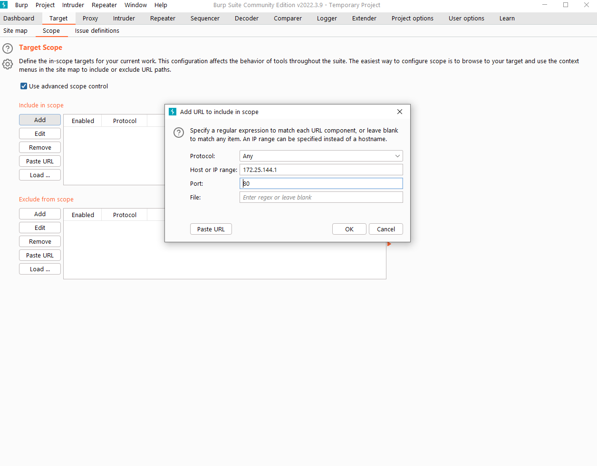
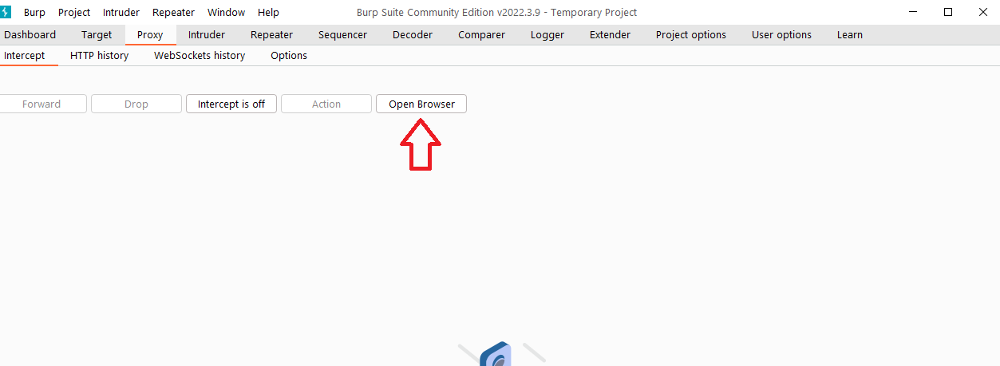
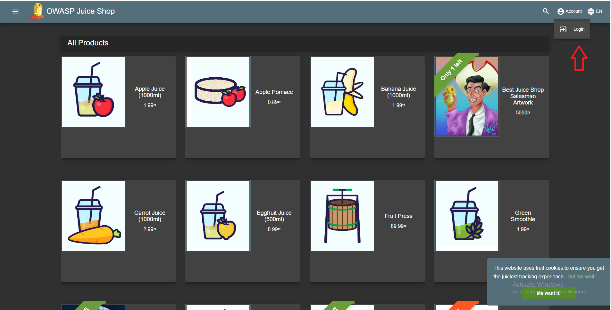
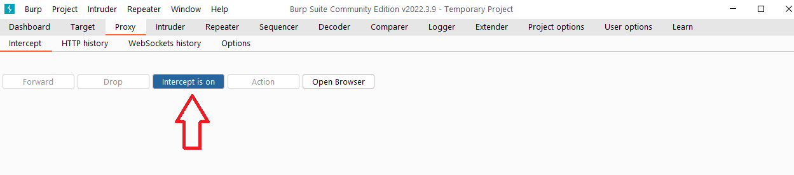
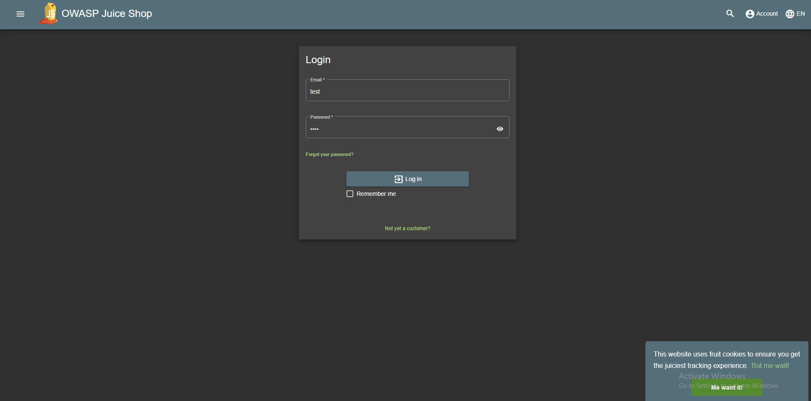
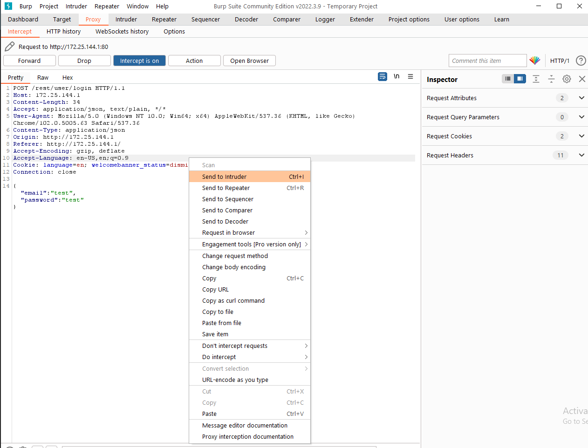

# Web Testing

In this lab we will be starting up a vulnerable web server called OWASP Juicy Shop.  It is designed from the ground up to teach people about a number of web application attacks.

While a full intro to web attacks is out of the scope of this class, it is great to show you how to use tools like BurpSuite & Nikto  to automatically look for some vulnerabilities, and to show you that automated tools do not always catch everything.

Let’s get started by opening a Docker Desktop as Administrator

In menu tab select `Images`

You will see the image called `bkimminich/juice-shop`, click the button `RUN` and set the port on local host section to 80 and click `RUN`.

Get the ip address, note that your ip will be different

Lets check that Juicy Shop is running by going to the address http://172.25.144.1/#/score-board. You will see a list of vulnerabilities sorted by difficulty. Actually finding a score-board page is one of the challenges of the application. Some challenges have tutorials that provide solutions, if you want to learn more about vulnerabilties and how to solve them in OWASP Juicy Shop, then the website https://pwning.owasp-juice.shop/ has great tutorials that explain in detail challenges present in the application.

  
Lets switch over to Kali to do some automatic scans with Nikto and see how many vulnerabilties it can detect.

Run the next command `nikto -host http://172.25.144.1` (Your ip will be different). We can see that it detected the url path named `/ftp` that contains valuable information, other than that false positives are rampant.

Next, let's try to poke around the application with BurpSuite by itercepting requests and checking manually for some vulnerabilties. 

We will try to bruteforce usernames for common password lists obtained from SecLists. The password list `best1050.txt` is used for simplicity.

Open BurpSuite:

Select `Temporary project` and click `Next`

Select ` Use Burp defaults` click `Next` again

First you need to configure the scope domain for intercepting requests. In our case it is the ip of vulnerable application. To configure it go to the tab `Target` and select the subsection `Scope`.

Select `Use advanced scope control`. Next click `Add` and write down the ip of windows machine. The port is `80`.

Now target set, we can open the BurpSuite's built in browser for intercepting requests. To do it go to `Proxy` tab and click the subsection `Intercept`.

Once the browser opens, we can go to the login page.

Click the `Login` button.

You will be redirected to the login page. For now you can enter anything into the username and password input, but don't click the login button.

Let's first enable BurpSuite's interception. By going to `Proxy` -> `Intercept` and click `Intercept is off` button.

Now you can go to the login page. Enter any username and password to the input fields, then click `Login` button.

Switch over to BurpSuite. You will see the itercepted request. Once you have the request intercepted, we can do our bruteforce attack. To do it right click over the intercepted request and send click `Send to Intruder`

